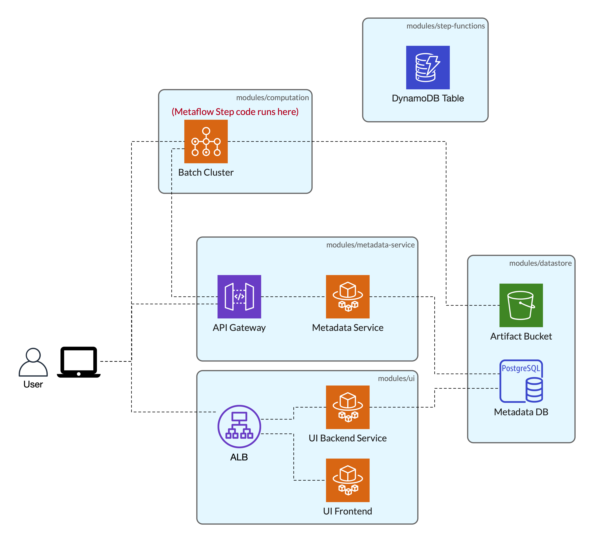

[](http://slack.outerbounds.co/)

# Metaflow Terraform module

Terraform module that provisions AWS resources to run [Metaflow](https://metaflow.org/) in production.

This module consists of submodules that can be used separately as well:

- AWS Batch cluster to run Metaflow steps ([`metaflow-computation`](./modules/computation))
- blob storage and metadata database ([`metaflow-datastore`](./modules/datastore))
- a service providing API to record and query past executions ([`metaflow-metadata-service`](./modules/metadata-service))
- resources to deploy Metaflow flows on Step Functions processing ([`metaflow-step-functions`](./modules/step-functions))
- Metaflow UI([`metaflow-ui`](./modules/ui))



You can either use this high-level module, or submodules individually. See each submodule's corresponding `README.md` for more details.

Here's a minimal end-to-end example of using this module with VPC:

```terraform
# Random suffix for this deployment
resource "random_string" "suffix" {
  length  = 8
  special = false
  upper = false
}

locals {
  resource_prefix = "metaflow"
  resource_suffix = random_string.suffix.result
}

data "aws_availability_zones" "available" {
}

# VPC infra using https://github.com/terraform-aws-modules/terraform-aws-vpc
module "vpc" {
  source = "terraform-aws-modules/vpc/aws"
  version = "3.13.0"

  name = "${local.resource_prefix}-${local.resource_suffix}"
  cidr = "10.10.0.0/16"

  azs             = data.aws_availability_zones.available.names
  private_subnets = ["10.10.8.0/21", "10.10.16.0/21", "10.10.24.0/21"]
  public_subnets  = ["10.10.128.0/21", "10.10.136.0/21", "10.10.144.0/21"]

  enable_nat_gateway   = true
  single_nat_gateway   = true
  enable_dns_hostnames = true
}


module "metaflow" {
  source = "outerbounds/metaflow/aws"
  version = "0.3.0"

  resource_prefix = local.resource_prefix
  resource_suffix = local.resource_suffix

  enable_step_functions = false
  subnet1_id            = module.vpc.public_subnets[0]
  subnet2_id            = module.vpc.public_subnets[1]
  vpc_cidr_blocks       = module.vpc.vpc_cidr_blocks
  vpc_id                = module.vpc.vpc_id
  with_public_ip        = true

  tags = {
      "managedBy" = "terraform"
  }
}

# export all outputs from metaflow modules
output "metaflow" {
  value = module.metaflow
}

# The module will generate a Metaflow config in JSON format, write it to a file
resource "local_file" "metaflow_config" {
  content  = module.metaflow.metaflow_profile_json
  filename = "./metaflow_profile.json"
}
```

**Note:** You can find a more complete example that uses this module but also includes setting up sagemaker notebooks and other non-Metaflow-specific parts of infra [in this repo](https://github.com/outerbounds/metaflow-tools/tree/master/aws/terraform).

<!-- BEGIN_TF_DOCS -->
## Modules

| Name | Source | Version |
|------|--------|---------|
| <a name="module_eks"></a> [eks](#module\_eks) | terraform-aws-modules/eks/aws | 20.31.6 |
| <a name="module_metaflow-common"></a> [metaflow-common](#module\_metaflow-common) | ./modules/common | n/a |
| <a name="module_metaflow-computation"></a> [metaflow-computation](#module\_metaflow-computation) | ./modules/computation | n/a |
| <a name="module_metaflow-datastore"></a> [metaflow-datastore](#module\_metaflow-datastore) | ./modules/datastore | n/a |
| <a name="module_metaflow-metadata-service"></a> [metaflow-metadata-service](#module\_metaflow-metadata-service) | ./modules/metadata-service | n/a |
| <a name="module_metaflow-step-functions"></a> [metaflow-step-functions](#module\_metaflow-step-functions) | ./modules/step-functions | n/a |
| <a name="module_metaflow-ui"></a> [metaflow-ui](#module\_metaflow-ui) | ./modules/ui | n/a |
| <a name="module_metaflow_helm"></a> [metaflow\_helm](#module\_metaflow\_helm) | ./modules/services | n/a |
| <a name="module_vpc"></a> [vpc](#module\_vpc) | terraform-aws-modules/vpc/aws | ~> 5.0 |

## Inputs

| Name | Description | Type | Default | Required |
|------|-------------|------|---------|:--------:|
| <a name="input_access_list_cidr_blocks"></a> [access\_list\_cidr\_blocks](#input\_access\_list\_cidr\_blocks) | List of CIDRs we want to grant access to the Metaflow Metadata Service. Usually this is should be your VPN's CIDR blocks. | `list(string)` | `[]` | no |
| <a name="input_azs"></a> [azs](#input\_azs) | A list of availability zones names in the region | `list(string)` | `[]` | no |
| <a name="input_batch_type"></a> [batch\_type](#input\_batch\_type) | AWS Batch Compute Type ('ec2', 'fargate') | `string` | `"ec2"` | no |
| <a name="input_compute_environment_desired_vcpus"></a> [compute\_environment\_desired\_vcpus](#input\_compute\_environment\_desired\_vcpus) | Desired Starting VCPUs for Batch Compute Environment [0-16] for EC2 Batch Compute Environment (ignored for Fargate) | `number` | `8` | no |
| <a name="input_compute_environment_egress_cidr_blocks"></a> [compute\_environment\_egress\_cidr\_blocks](#input\_compute\_environment\_egress\_cidr\_blocks) | CIDR blocks to which egress is allowed from the Batch Compute environment's security group | `list(string)` | <pre>[<br>  "0.0.0.0/0"<br>]</pre> | no |
| <a name="input_compute_environment_instance_types"></a> [compute\_environment\_instance\_types](#input\_compute\_environment\_instance\_types) | The instance types for the compute environment | `list(string)` | <pre>[<br>  "c5.large",<br>  "c5.xlarge",<br>  "c5.2xlarge",<br>  "c5.4xlarge",<br>  "c5.9xlarge"<br>]</pre> | no |
| <a name="input_compute_environment_max_vcpus"></a> [compute\_environment\_max\_vcpus](#input\_compute\_environment\_max\_vcpus) | Maximum VCPUs for Batch Compute Environment [16-96] | `number` | `64` | no |
| <a name="input_compute_environment_min_vcpus"></a> [compute\_environment\_min\_vcpus](#input\_compute\_environment\_min\_vcpus) | Minimum VCPUs for Batch Compute Environment [0-16] for EC2 Batch Compute Environment (ignored for Fargate) | `number` | `8` | no |
| <a name="input_create_datastore"></a> [create\_datastore](#input\_create\_datastore) | Set to create the datastore components for metaflow such as S3 bucket, Postgres database, etc. This value should be set to true in most cases except if the components created by the module are being deployed in kubernetes or are being created through another means. | `bool` | `true` | no |
| <a name="input_create_eks_cluster"></a> [create\_eks\_cluster](#input\_create\_eks\_cluster) | Set to create an EKS cluster | `bool` | `false` | no |
| <a name="input_create_managed_compute"></a> [create\_managed\_compute](#input\_create\_managed\_compute) | Set to create metaflow compute resources in AWS Batch. This value should be set to false if the compute resources are deployed within a kubernetes cluster | `bool` | `true` | no |
| <a name="input_create_managed_metaflow_metadata_service"></a> [create\_managed\_metaflow\_metadata\_service](#input\_create\_managed\_metaflow\_metadata\_service) | Set to create metaflow metadata-service in managed AWS ECS service. This value should be set to false if the metadata service is deployed within a kubernetes cluster | `bool` | `true` | no |
| <a name="input_create_managed_metaflow_ui"></a> [create\_managed\_metaflow\_ui](#input\_create\_managed\_metaflow\_ui) | Set to create metaflow UI in managed AWS ECS service. This value should be set to false if the UI is deployed within a kubernetes cluster | `bool` | `false` | no |
| <a name="input_create_public_subnets_only"></a> [create\_public\_subnets\_only](#input\_create\_public\_subnets\_only) | Set to create a VPC with only public subnets. Using only public subnets helps reduce AWS costs by removing the need to create a NAT gateway. However, it also increases security risk to your infrastructure since a misconfigured security group can expose your infrastructure on the public internet. Hence we only recommend setting this for experimental deployments. | `bool` | `false` | no |
| <a name="input_create_step_functions"></a> [create\_step\_functions](#input\_create\_step\_functions) | Provisions infrastructure for step functions if enabled | `bool` | `false` | no |
| <a name="input_create_vpc"></a> [create\_vpc](#input\_create\_vpc) | Controls if VPC should be created (it affects almost all resources) | `bool` | `false` | no |
| <a name="input_database_endpoint"></a> [database\_endpoint](#input\_database\_endpoint) | Endpoint for the database when create\_datastore is set to false. This variable must be set if you create\_datastore is set to false. | `string` | `""` | no |
| <a name="input_database_name"></a> [database\_name](#input\_database\_name) | Name of the database to be used when create\_datastore is set to false. This variable must be set if you create\_datastore is set to false. | `string` | `""` | no |
| <a name="input_database_password"></a> [database\_password](#input\_database\_password) | Password for the database when create\_datastore is set to false. This variable must be set if you create\_datastore is set to false. | `string` | `""` | no |
| <a name="input_database_username"></a> [database\_username](#input\_database\_username) | Username for the database when create\_datastore is set to false. This variable must be set if you create\_datastore is set to false. | `string` | `""` | no |
| <a name="input_db_engine_version"></a> [db\_engine\_version](#input\_db\_engine\_version) | The database engine version for the RDS instances. This value is also used to determine whether to create an Aurora RDS cluster or a classic RDS instance. | `string` | `"14"` | no |
| <a name="input_db_instance_type"></a> [db\_instance\_type](#input\_db\_instance\_type) | RDS instance type to launch for PostgresQL database. | `string` | `"db.t3.small"` | no |
| <a name="input_db_migrate_lambda_zip_file"></a> [db\_migrate\_lambda\_zip\_file](#input\_db\_migrate\_lambda\_zip\_file) | Output path for the zip file containing the DB migrate lambda | `string` | `null` | no |
| <a name="input_deploy_cluster_autoscaler"></a> [deploy\_cluster\_autoscaler](#input\_deploy\_cluster\_autoscaler) | Set to deploy the cluster autoscaler | `bool` | `false` | no |
| <a name="input_deploy_metaflow_services_in_eks"></a> [deploy\_metaflow\_services\_in\_eks](#input\_deploy\_metaflow\_services\_in\_eks) | Set to deploy metaflow metadata service and metaflow ui via the helm chart. | `bool` | `false` | no |
| <a name="input_enable_custom_batch_container_registry"></a> [enable\_custom\_batch\_container\_registry](#input\_enable\_custom\_batch\_container\_registry) | Provisions infrastructure for custom Amazon ECR container registry if enabled | `bool` | `false` | no |
| <a name="input_enable_key_rotation"></a> [enable\_key\_rotation](#input\_enable\_key\_rotation) | Enable key rotation for KMS keys | `bool` | `false` | no |
| <a name="input_existing_private_subnet_ids"></a> [existing\_private\_subnet\_ids](#input\_existing\_private\_subnet\_ids) | List of private subnet ids that will be used to create metaflow components in. If create\_vpc is set to false, either private\_subnet\_ids, public\_subnet\_ids or both need to be set. Setting private\_subnet\_ids will result in a more | `list(string)` | `[]` | no |
| <a name="input_existing_public_subnet_ids"></a> [existing\_public\_subnet\_ids](#input\_existing\_public\_subnet\_ids) | List of public subnet\_ids that will be used to create metaflow components that you want to expose on the public internet. This may need to be set if create\_vpc is set to false | `list(string)` | `[]` | no |
| <a name="input_existing_vpc_cidr_blocks"></a> [existing\_vpc\_cidr\_blocks](#input\_existing\_vpc\_cidr\_blocks) | The VPC CIDR blocks that we'll access list on our Metadata Service API to allow all internal communications. Needs to be set if create\_vpc is set to false | `list(string)` | `[]` | no |
| <a name="input_existing_vpc_id"></a> [existing\_vpc\_id](#input\_existing\_vpc\_id) | The id of the single VPC we stood up for all Metaflow resources to exist in. Needs to be set if create\_vpc is set to false | `string` | `""` | no |
| <a name="input_extra_ui_backend_env_vars"></a> [extra\_ui\_backend\_env\_vars](#input\_extra\_ui\_backend\_env\_vars) | Additional environment variables for UI backend container | `map(string)` | `{}` | no |
| <a name="input_extra_ui_static_env_vars"></a> [extra\_ui\_static\_env\_vars](#input\_extra\_ui\_static\_env\_vars) | Additional environment variables for UI static app | `map(string)` | `{}` | no |
| <a name="input_force_destroy_s3_bucket"></a> [force\_destroy\_s3\_bucket](#input\_force\_destroy\_s3\_bucket) | Empty S3 bucket before destroying via terraform destroy | `bool` | `true` | no |
| <a name="input_iam_partition"></a> [iam\_partition](#input\_iam\_partition) | IAM Partition (Select aws-us-gov for AWS GovCloud, otherwise leave as is) | `string` | `"aws"` | no |
| <a name="input_launch_template_http_endpoint"></a> [launch\_template\_http\_endpoint](#input\_launch\_template\_http\_endpoint) | Whether the metadata service is available. Can be 'enabled' or 'disabled' | `string` | `"enabled"` | no |
| <a name="input_launch_template_http_put_response_hop_limit"></a> [launch\_template\_http\_put\_response\_hop\_limit](#input\_launch\_template\_http\_put\_response\_hop\_limit) | The desired HTTP PUT response hop limit for instance metadata requests. Can be an integer from 1 to 64 | `number` | `2` | no |
| <a name="input_launch_template_http_tokens"></a> [launch\_template\_http\_tokens](#input\_launch\_template\_http\_tokens) | Whether or not the metadata service requires session tokens, also referred to as Instance Metadata Service Version 2 (IMDSv2). Can be 'optional' or 'required' | `string` | `"optional"` | no |
| <a name="input_metadata_service_container_image"></a> [metadata\_service\_container\_image](#input\_metadata\_service\_container\_image) | Container image for metadata service | `string` | `""` | no |
| <a name="input_metadata_service_enable_api_basic_auth"></a> [metadata\_service\_enable\_api\_basic\_auth](#input\_metadata\_service\_enable\_api\_basic\_auth) | Enable basic auth for API Gateway? (requires key export) | `bool` | `true` | no |
| <a name="input_metadata_service_enable_api_gateway"></a> [metadata\_service\_enable\_api\_gateway](#input\_metadata\_service\_enable\_api\_gateway) | Enable API Gateway for public metadata service endpoint | `bool` | `true` | no |
| <a name="input_metaflow_helm_values"></a> [metaflow\_helm\_values](#input\_metaflow\_helm\_values) | These are used to override the default values of the metaflow helm chart | `any` | `{}` | no |
| <a name="input_metaflow_s3_bucket_arn"></a> [metaflow\_s3\_bucket\_arn](#input\_metaflow\_s3\_bucket\_arn) | ARN of the S3 bucket to be used when create\_datastore is set to false. This variable must be set if you create\_datastore is set to false. | `string` | `""` | no |
| <a name="input_metaflow_s3_bucket_kms_key_arn"></a> [metaflow\_s3\_bucket\_kms\_key\_arn](#input\_metaflow\_s3\_bucket\_kms\_key\_arn) | ARN of the KMS key used to encrypt the S3 bucket when create\_datastore is set to false. This variable must be set if you create\_datastore is set to false. | `string` | `""` | no |
| <a name="input_metaflow_s3_sys_root"></a> [metaflow\_s3\_sys\_root](#input\_metaflow\_s3\_sys\_root) | The S3 root prefix in the metaflow s3 bucket to use. This variable must be set if you create\_datastore is set to false. | `string` | `""` | no |
| <a name="input_metaflow_ui_is_public"></a> [metaflow\_ui\_is\_public](#input\_metaflow\_ui\_is\_public) | Set to true if you would like to make the metaflow UI load balancer publicly accessible | `bool` | `false` | no |
| <a name="input_node_group_defaults"></a> [node\_group\_defaults](#input\_node\_group\_defaults) | A key value map of EKS node group default configurations that will directly override the inputs top the upstream EKS terraform module. | `any` | `{}` | no |
| <a name="input_node_group_iam_role_additional_policies"></a> [node\_group\_iam\_role\_additional\_policies](#input\_node\_group\_iam\_role\_additional\_policies) | A list of additional IAM policies to attach to the EKS worker nodes. This value directly overrides the input to the upstream EKS terraform module | `map(string)` | `{}` | no |
| <a name="input_node_groups"></a> [node\_groups](#input\_node\_groups) | A key value map of EKS node group definitions that will directly override the inputs top the upstream EKS terraform module. | `any` | `{}` | no |
| <a name="input_private_subnet_tags"></a> [private\_subnet\_tags](#input\_private\_subnet\_tags) | Additional tags for the private subnets | `map(string)` | `{}` | no |
| <a name="input_public_subnet_tags"></a> [public\_subnet\_tags](#input\_public\_subnet\_tags) | Additional tags for the public subnets | `map(string)` | `{}` | no |
| <a name="input_resource_prefix"></a> [resource\_prefix](#input\_resource\_prefix) | string prefix for all resources | `string` | `""` | no |
| <a name="input_resource_suffix"></a> [resource\_suffix](#input\_resource\_suffix) | string suffix for all resources | `string` | `""` | no |
| <a name="input_tags"></a> [tags](#input\_tags) | aws tags | `map(string)` | n/a | yes |
| <a name="input_ui_allow_list"></a> [ui\_allow\_list](#input\_ui\_allow\_list) | List of CIDRs we want to grant access to our Metaflow UI Service. Usually this is our VPN's CIDR blocks. | `list(string)` | `[]` | no |
| <a name="input_ui_certificate_arn"></a> [ui\_certificate\_arn](#input\_ui\_certificate\_arn) | SSL certificate for UI. This value must be set if create\_metaflow\_ui is set to true. | `string` | `""` | no |
| <a name="input_ui_static_container_image"></a> [ui\_static\_container\_image](#input\_ui\_static\_container\_image) | Container image for the UI frontend app | `string` | `""` | no |
| <a name="input_vpc_cidr"></a> [vpc\_cidr](#input\_vpc\_cidr) | The CIDR block for the VPC | `string` | `"10.0.0.0/16"` | no |

## Outputs

| Name | Description |
|------|-------------|
| <a name="output_METAFLOW_BATCH_JOB_QUEUE"></a> [METAFLOW\_BATCH\_JOB\_QUEUE](#output\_METAFLOW\_BATCH\_JOB\_QUEUE) | AWS Batch Job Queue ARN for Metaflow |
| <a name="output_METAFLOW_DATASTORE_SYSROOT_S3"></a> [METAFLOW\_DATASTORE\_SYSROOT\_S3](#output\_METAFLOW\_DATASTORE\_SYSROOT\_S3) | Amazon S3 URL for Metaflow DataStore |
| <a name="output_METAFLOW_DATATOOLS_S3ROOT"></a> [METAFLOW\_DATATOOLS\_S3ROOT](#output\_METAFLOW\_DATATOOLS\_S3ROOT) | Amazon S3 URL for Metaflow DataTools |
| <a name="output_METAFLOW_ECS_S3_ACCESS_IAM_ROLE"></a> [METAFLOW\_ECS\_S3\_ACCESS\_IAM\_ROLE](#output\_METAFLOW\_ECS\_S3\_ACCESS\_IAM\_ROLE) | Role for AWS Batch to Access Amazon S3 |
| <a name="output_METAFLOW_EVENTS_SFN_ACCESS_IAM_ROLE"></a> [METAFLOW\_EVENTS\_SFN\_ACCESS\_IAM\_ROLE](#output\_METAFLOW\_EVENTS\_SFN\_ACCESS\_IAM\_ROLE) | IAM role for Amazon EventBridge to access AWS Step Functions. |
| <a name="output_METAFLOW_SERVICE_INTERNAL_URL"></a> [METAFLOW\_SERVICE\_INTERNAL\_URL](#output\_METAFLOW\_SERVICE\_INTERNAL\_URL) | URL for Metadata Service (Accessible in VPC) |
| <a name="output_METAFLOW_SERVICE_URL"></a> [METAFLOW\_SERVICE\_URL](#output\_METAFLOW\_SERVICE\_URL) | URL for Metadata Service (Accessible in VPC) |
| <a name="output_METAFLOW_SFN_DYNAMO_DB_TABLE"></a> [METAFLOW\_SFN\_DYNAMO\_DB\_TABLE](#output\_METAFLOW\_SFN\_DYNAMO\_DB\_TABLE) | AWS DynamoDB table name for tracking AWS Step Functions execution metadata. |
| <a name="output_METAFLOW_SFN_IAM_ROLE"></a> [METAFLOW\_SFN\_IAM\_ROLE](#output\_METAFLOW\_SFN\_IAM\_ROLE) | IAM role for AWS Step Functions to access AWS resources (AWS Batch, AWS DynamoDB). |
| <a name="output_api_gateway_rest_api_id_key_id"></a> [api\_gateway\_rest\_api\_id\_key\_id](#output\_api\_gateway\_rest\_api\_id\_key\_id) | API Gateway Key ID for Metadata Service. Fetch Key from AWS Console [METAFLOW\_SERVICE\_AUTH\_KEY] |
| <a name="output_batch_compute_environment_security_group_id"></a> [batch\_compute\_environment\_security\_group\_id](#output\_batch\_compute\_environment\_security\_group\_id) | The ID of the security group attached to the Batch Compute environment. |
| <a name="output_datastore_s3_bucket_kms_key_arn"></a> [datastore\_s3\_bucket\_kms\_key\_arn](#output\_datastore\_s3\_bucket\_kms\_key\_arn) | The ARN of the KMS key used to encrypt the Metaflow datastore S3 bucket |
| <a name="output_metadata_svc_ecs_task_role_arn"></a> [metadata\_svc\_ecs\_task\_role\_arn](#output\_metadata\_svc\_ecs\_task\_role\_arn) | n/a |
| <a name="output_metaflow_api_gateway_rest_api_id"></a> [metaflow\_api\_gateway\_rest\_api\_id](#output\_metaflow\_api\_gateway\_rest\_api\_id) | The ID of the API Gateway REST API we'll use to accept MetaData service requests to forward to the Fargate API instance |
| <a name="output_metaflow_aws_managed_profile_json"></a> [metaflow\_aws\_managed\_profile\_json](#output\_metaflow\_aws\_managed\_profile\_json) | Metaflow profile JSON object that can be used to communicate with this Metaflow Stack. Store this in `~/.metaflow/config_[stack-name]` and select with `$ export METAFLOW_PROFILE=[stack-name]`. |
| <a name="output_metaflow_batch_container_image"></a> [metaflow\_batch\_container\_image](#output\_metaflow\_batch\_container\_image) | The ECR repo containing the metaflow batch image |
| <a name="output_metaflow_s3_bucket_arn"></a> [metaflow\_s3\_bucket\_arn](#output\_metaflow\_s3\_bucket\_arn) | The ARN of the bucket we'll be using as blob storage |
| <a name="output_metaflow_s3_bucket_name"></a> [metaflow\_s3\_bucket\_name](#output\_metaflow\_s3\_bucket\_name) | The name of the bucket we'll be using as blob storage |
| <a name="output_migration_function_arn"></a> [migration\_function\_arn](#output\_migration\_function\_arn) | ARN of DB Migration Function |
| <a name="output_ui_alb_arn"></a> [ui\_alb\_arn](#output\_ui\_alb\_arn) | UI ALB ARN |
| <a name="output_ui_alb_dns_name"></a> [ui\_alb\_dns\_name](#output\_ui\_alb\_dns\_name) | UI ALB DNS name |
<!-- END_TF_DOCS -->
